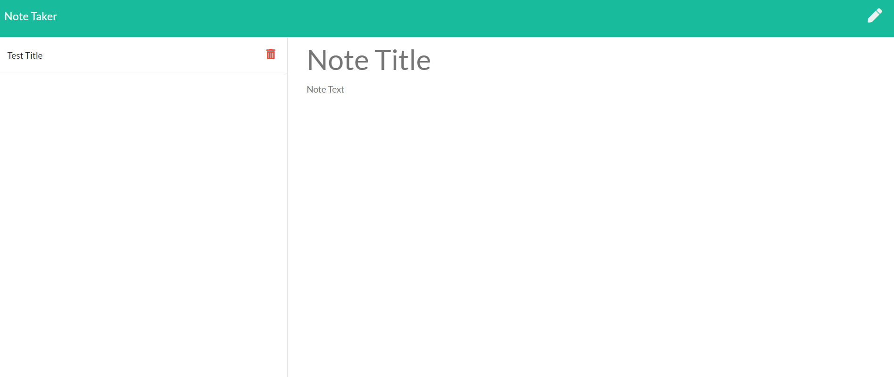

# Note Taker

## Project Description

This is a application that you can create notes and save them. When you are done with them, you can delete them. https://scmcphee9.github.io/Note_Taker/ or

## Table of Contents

- [Installation](#installation)
- [Usage](#usage)
- [Contributing](#contributing)

- [Tests](#tests)
- [Questions](#questions)

## Installation

npm i

## Usage

run node server.js to start a local server

## Contributing

none

## Tests

none

## Questions?

Contact me by GitHub or Email:

- GitHub username: [scmcphee9](https://github.com/scmcphee9)
- Email Address: scmcphee9@gmail.com
